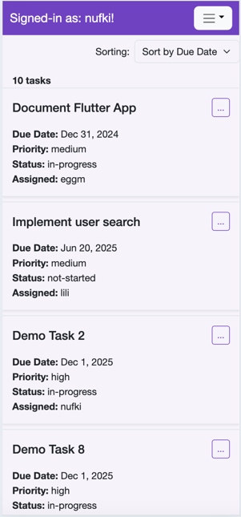
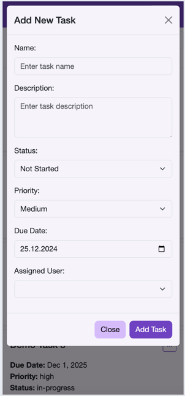
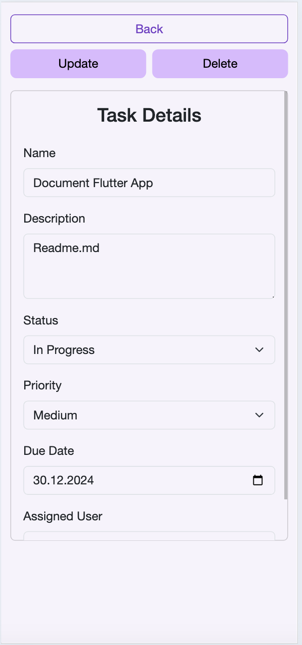
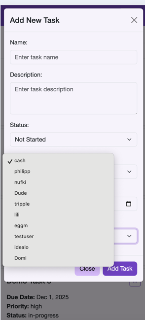
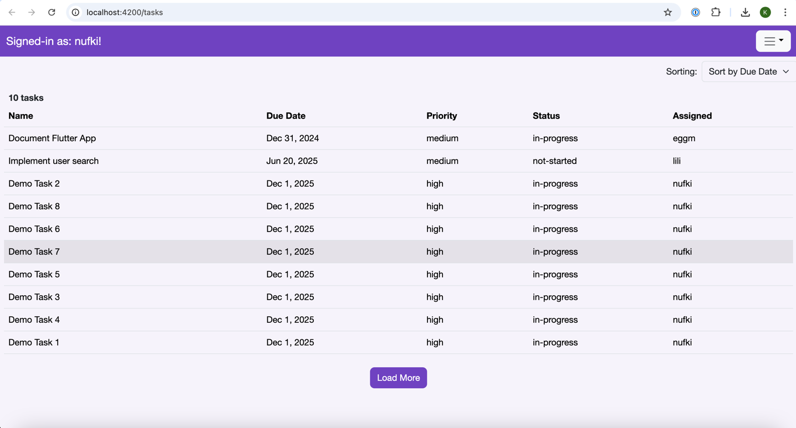
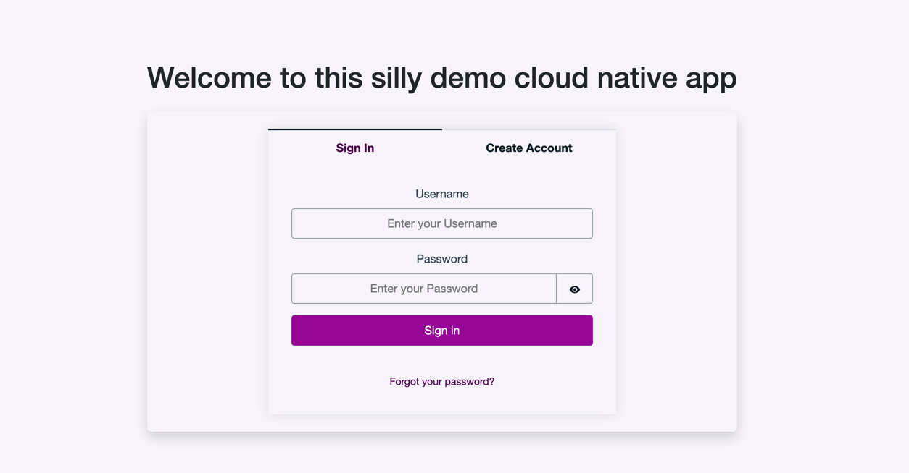
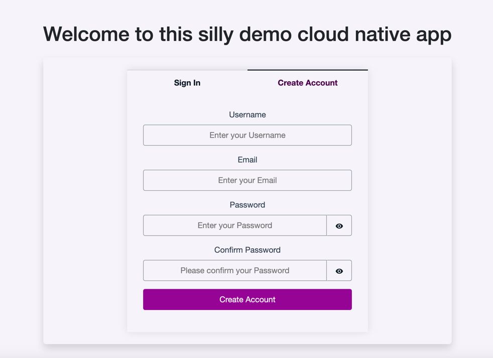

# Simple Task Manager - Angular Frontend 
This is the corresponding Angular application for the Simple Task Manager, a project that provides functionality for
managing task and is only meant for demo purposes. The app integrates with a backend API and has a matching Flutter app implementation.

## Implemented functionality
### **Features**
- Simple app that allows to list, create, update and delete tasks
- The app interacts with the task manager API that is deployed in the backend (which includes the infrastructure as well in AWS cdk)
- Next to the task API, I implemented a single User API that allows to list all signed-up users (with pagination and optional username search)
  which however was not yet implemented fully in this app (only lists the users - no searching)
- The APIs are secured by AWS Cognito that issues an ID Token once the user has signed up and is signed in.
- Supported user authentication flows:
  - Sign-up
  - Sign-in
  - Confirm account via code sent via email
  - Reset password
  - Confirm reset password via code sent via email

Demo Link: https://d1b07mtd9j77x2.cloudfront.net (uptime not ensured)

### **Technology Stack**
- **Backend**: [Task Manager Backend](https://github.com/nufki/task-manager-backend).
- **Angular web frontend**: (This repo) [Angular Frontend](https://github.com/nufki/task-manager-frontend) (version 18.2).
- **Flutter app**: [Flutter App](https://github.com/nufki/task_manager_app)


### Used libraries
This application uses:
- bootstrap as the main design library: https://getbootstrap.com/
- ngrx to manage the application state: https://ngrx.io/

# Configuration
Configure the AWS cognito parameters that will be available in you AWS account an region: 
`amplifyconfiguration.json`
```
{
  "aws_project_region": "YOUR-REGION",
  "aws_cognito_region": "YOUR-REGION",
  "aws_user_pools_id": "YOUR-POOL_ID",
  "aws_user_pools_web_client_id": "YOUR-POOL-CLIENT-ID"
}
```

## Impressions (maybe outdated)
<div style="display: flex; justify-content: space-evenly; flex-wrap: wrap;">
  
  
  
  
  
  
  
</div>


## Installation and Running the Application

### Install Dependencies
Run the following command to install all necessary dependencies:
```bash
npm install
```

### Build the Project
To build the project, use:
```bash
ng build
```

### Run Development Server
To start a development server, execute:
```bash
ng serve
```
Navigate to `http://localhost:4200/` to view the application. The server automatically reloads when changes are made.

### Production Build
To create an optimized production build:
```bash
ng build --configuration production
```

## Analyzing Bundle Size
The application bundle can be large due to dependencies like AWS Amplify. Use the source-map-explorer tool to analyze:

```bash
ng build --configuration production --source-map=true

source-map-explorer dist/task-manager-frontend/browser/main.js --no-border-checks
```

**Note**: Amplify contributes to ~40% of the bundle size. This demo project does not include advanced optimizations to reduce bundle size.

---
